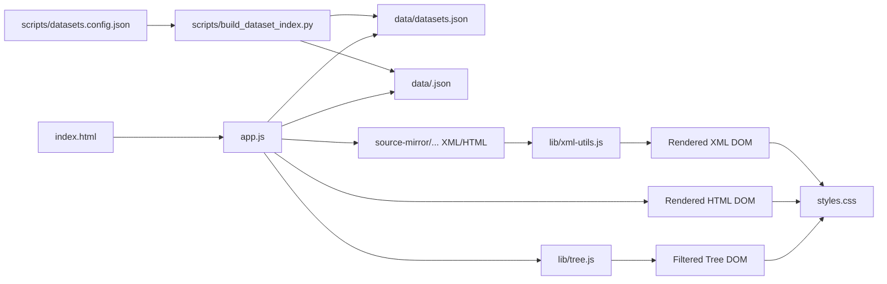
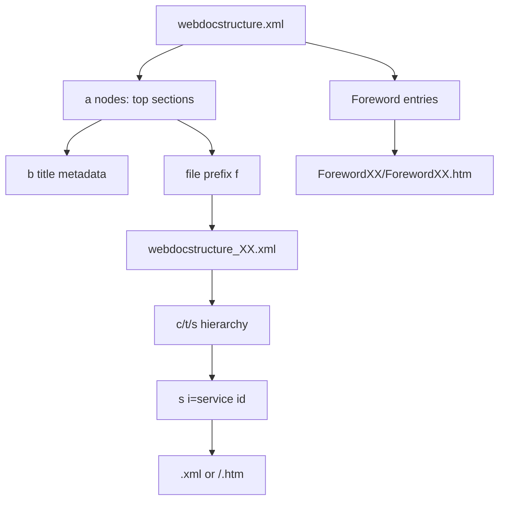
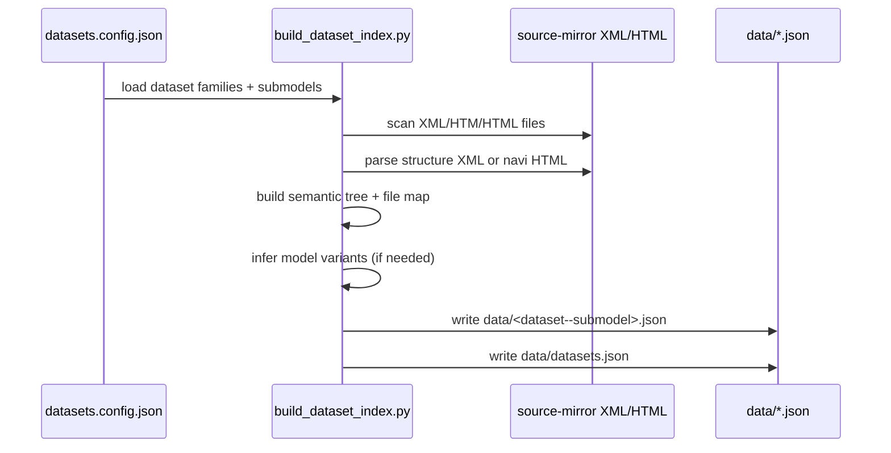

# Modern Manual Site Technical README

This document describes the architecture of the frame-free modern viewer in `modern-manual-site`, with special focus on XML source relationships, index generation, and runtime rendering.

## Goals

- Render mirrored Suzuki manual content without frames.
- Preserve legacy information architecture (sections, subsections, references, graphics) while using a modern single-page UI.
- Support multiple dataset families and submodels from one app shell.
- Keep the site static so it can deploy cleanly on GitHub Pages.

## High-Level Architecture



## Key Files And Responsibilities

- `index.html`
  - App shell and controls (dataset/submodel/model selectors, tree filter, viewer pane).
  - Cache-busted references to `app.js` and `styles.css`.

- `app.js`
  - Runtime state, dataset switching, model filtering, tree rendering, file loading.
  - HTML document rewrite/sanitization and TOC row click wiring.
  - Diagram lightbox behavior, internal anchor scrolling, and navigation persistence.

- `lib/xml-utils.js`
  - XML cleaning and parser fallback logic.
  - XML tag-to-DOM renderer (`renderNode`) for Suzuki-specific SGML/XML structures.
  - Inline cross-reference handling (`intxref`), table layout handling (`colspec`, `namest/nameend`, `morerows`).

- `lib/tree.js`
  - Pure tree search filtering.

- `scripts/build_dataset_index.py`
  - Offline build tool that turns mirrored files into semantic dataset indexes.

- `scripts/datasets.config.json`
  - Declares dataset families, submodels, and structure entry files.

- `data/*.json`
  - Generated runtime index artifacts consumed by the SPA.

## XML Source Relationships

The modern viewer relies on the same manual graph used by the legacy system. The build script resolves this graph into a static JSON tree.

### Core Relationship Model



### Related XML Variants

- `webdocstructure.xml`
  - Top-level chapter and foreword map.

- `webdocstructure_*.xml`
  - Section-specific structure branches referenced by file prefix in top-level map.

- `webdocstructure-sym.xml`, `webdocstructure-dtc.xml`
  - Alternative structure trees (symbol and DTC-oriented branches).
  - One of these may be selected as `structure_xml` in config.

- Content files
  - Service XML pages: `AEN... .xml`
  - Foreword or other HTML pages: `.../ForewordNN/ForewordNN.htm`

### Navigation Fallback Order (Build-Time)

The index builder uses this precedence for tree construction:

1. `webdocstructure` semantic tree
2. `navi/navi.html` semantic extraction fallback
3. Filesystem folder/file fallback

This logic preserves navigation semantics even when one source is incomplete.

## Build-Time Index Generation

`scripts/build_dataset_index.py` produces per-submodel indexes and a global manifest.

### Build Pipeline



### Generated JSON Contract

Per-submodel file contains:

- `id`, `name`, `xmlRoot`
- `modelVariants`
- `tree` (folder/file nodes)
- `files` map keyed by web path with title/relative metadata
- `firstFilePath`
- `fileCount`
- `source` (`semantic-structure`, `semantic-navi`, or `filesystem`)

Global manifest (`data/datasets.json`) contains dataset families and submodel index URLs.

## Runtime Rendering Pipeline

At runtime, the app loads static JSON indexes and then fetches content documents directly.

### Runtime Flow

```mermaid
flowchart TD
   A[bootstrap()] --> B[load data/datasets.json]
   B --> C[load submodel index JSON]
   C --> D[render tree]
   D --> E[select file path]
   E --> F{file extension}
   F -->|.xml| G[parseXml + renderXmlDocument]
   F -->|.htm/.html| H[renderHtmlDocument]
   G --> I[viewer DOM]
   H --> I
```

### XML Rendering Model (`lib/xml-utils.js`)

`renderNode` maps important tags:

- Structure/containers
  - `suzuki`, `manual`, `section`, `servcat`, `configtype`, `servinfotype`, `servinfo`, `topic`, `s1/s2/s3`
  - Flattened into semantic output where appropriate.

- Content
  - `title` -> `h2/h3`
  - `ptxt` -> paragraph
  - `list1/list2/list3` + `item` -> list items
  - `table/tgroup/row/entry` -> HTML table with span + colspec width support
  - `figure/graphic` -> rendered diagrams with fallback resolution
  - `deflist/term/def` -> glossary-style rows
  - `callout`, `spec`, `attentionN` -> semantic callout blocks

- References
  - `intxref refid=...`
    - tries internal anchor scroll first (`servinfosub id=...`)
    - falls back to cross-file navigation via index `refToPath`

### Inline Text Rendering (`renderInline` function)

The `renderInline` function in `lib/xml-utils.js` handles mixed text nodes and inline elements (like anchor tags):

- Normalizes consecutive whitespace to single spaces to prevent formatting issues
- **Important**: Does NOT trim individual text nodes. Trimming would remove necessary spaces between text nodes and following inline elements (e.g., "Inspection: " followed by a link to "K14C" would become "Inspection:K14C" without the space).
- Preserves semantic whitespace boundaries by allowing trailing/leading spaces on text nodes to carry through to adjacent inline elements
- This ensures proper rendering of mixed content like "Inspection: [K14C Engine](link) and related items" with correct spacing.

### HTML Rendering Model (`app.js`)

- Parses with `DOMParser` and strips executable/metadata tags (`script`, `link`, `meta`, `title`, `base`).
- Rewrites `src`/`href` to deploy-safe paths.
- Adds image fallback candidates for mirrored legacy paths.
- Adds Table-of-Contents row behavior (code/title mapping to dataset tree paths).

## XML Internal Reference Relationships

Internal relationships inside one XML page are preserved:

```mermaid
flowchart LR
   A[intxref refid="AEN...001"] --> B[onNavigateInternal(refid)]
   B --> C[find [data-xml-id=refid] in viewer]
   C --> D[smooth scroll + highlight]

   A --> E[onNavigate(targetPath)]
   E --> F[loadSelectedFile()]
```

This supports patterns such as links to `servinfosub id="..."` subsections (for example, links like "Market Code Description").

## Asset Relationship Strategy

The renderer keeps XML and legacy assets interoperable by trying multiple path candidates.

- Graphics (`graphicname`)
  - Looks under top-level `image/<prefix>/...` with extension fallbacks.

- Symbols
  - Looks under top-level `symbol/` and `MA*` variants.

- HTML image references
  - Uses rewritten path first.
  - Falls back to legacy mirror path under `suzuki-manual/...` when needed.
  - Additional icon fallback for `icon/` assets.

## State Management And Persistence

The app persists state in `localStorage`:

- active dataset id
- active submodel id
- active model variant
- per-tree expanded folders
- selected file path
- tree scroll position
- theme

Tree state key format includes dataset, submodel, and model to avoid collisions.

## Model-Variant Filtering

The runtime can isolate content by model variant (for example `K14C` vs `K14D`).

- Variant sources:
  - declared by build output (`modelVariants`)
  - inferred from tree labels if missing

- Filtering behavior:
  - Handles explicit `Models` folders
  - Handles sibling model-named folders
  - Normalizes merged model trees for stable navigation

## Lightbox And Diagram Handling

- Large diagrams are detected and clickable.
- Lightbox includes zoom controls, keyboard shortcuts, and scrollable viewport for panning.
- This behavior is shared for XML and HTML-rendered images.

## Deployment Notes

- Site is static and GitHub Pages compatible.
- Deployment workflow stages `modern-manual-site` alongside legacy assets.
- Workflow compatibility logic now tolerates optional missing mirror directories for legacy-linked shared assets.

## How To Regenerate Data Indexes

From repository root:

```bash
python3 modern-manual-site/scripts/build_dataset_index.py
```

Then open:

```text
http://localhost:8000/suzuki-manual-scrapper/modern-manual-site/index.html
```

## Common Failure Modes

- Broken references from malformed mirrored paths
  - Usually duplicated prefixes in mirrored `navi` or `webdocstructure` files.

- Missing images/symbols
  - Usually path mismatch between `source-mirror` and top-level `image` / `symbol` locations.

- Tree mismatch
  - Usually caused by incomplete `structure_xml` or fallback to `navi` extraction.

- Internal links not scrolling
  - Usually missing `servinfosub id` or mismatched `intxref refid`.

## Directory Map

- `modern-manual-site/index.html`
- `modern-manual-site/app.js`
- `modern-manual-site/styles.css`
- `modern-manual-site/lib/tree.js`
- `modern-manual-site/lib/xml-utils.js`
- `modern-manual-site/scripts/datasets.config.json`
- `modern-manual-site/scripts/build_dataset_index.py`
- `modern-manual-site/data/`
- `modern-manual-site/source-mirror/`
